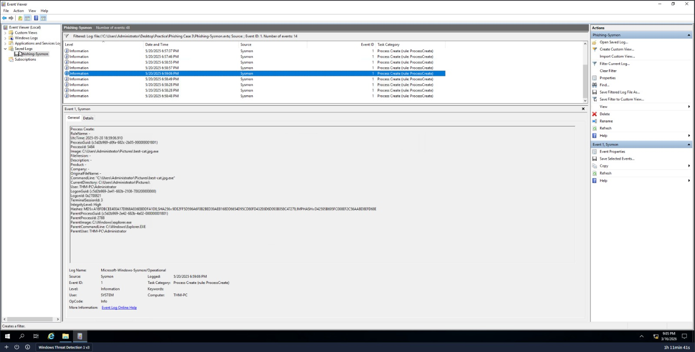
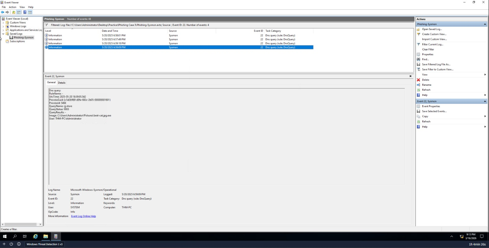

# Investigação de Phishing e Execução de Malware (Caso 3) 🛡️

**Cenário:** Investigação de um artefato malicioso descarregado via navegador e executado no host.

## 🔍 Metodologia de Investigação
A análise foi realizada utilizando o **Event Viewer** com foco nos logs do **Sysmon (Microsoft-Windows-Sysmon/Operational)**.

### 1. Vetor de Entrada e Descompactação
Identifiquei que o utilizador descarregou o arquivo `top-cats.zip` através do browser para a pasta de **Downloads**.
* **Local de Extração:** O conteúdo foi extraído para `C:\Users\Administrator\Pictures`.

### 2. Execução do Binário (Event ID 1)
Durante a análise dos logs, notei algo estranho no diretório \Pictures, o que me levou a filtrar pelo Event ID 1 (Process Create) para entender o que havia sido executado. Com isso, detectei o malware:
* **Arquivo:** `best-cat.jpg.exe` (utilizando técnica de dupla extensão para ludibriar o utilizador).
* **Diretório de Execução:** `C:\Users\Administrator\Pictures\`.
* **Process ID (PID):** 5484.

### 3. Comunicação com Comando e Controle (Event ID 22)
Ao analisar as consultas DNS (**Event ID 22**), confirmei que o malware tentou estabelecer ligação externa logo após a execução.
* **Domínio Malicioso:** `rjj.store`.
* **Processo Solicitante:** `C:\Users\Administrator\Pictures\best-cat.jpg.exe`.

## 💡 Conclusão
O incidente confirmou uma infecção por malware via Phishing. O atacante utilizou um nome de ficheiro focado em engenharia social para garantir a execução e, em seguida, tentou contactar um domínio de C2 externo para receber instruções.
